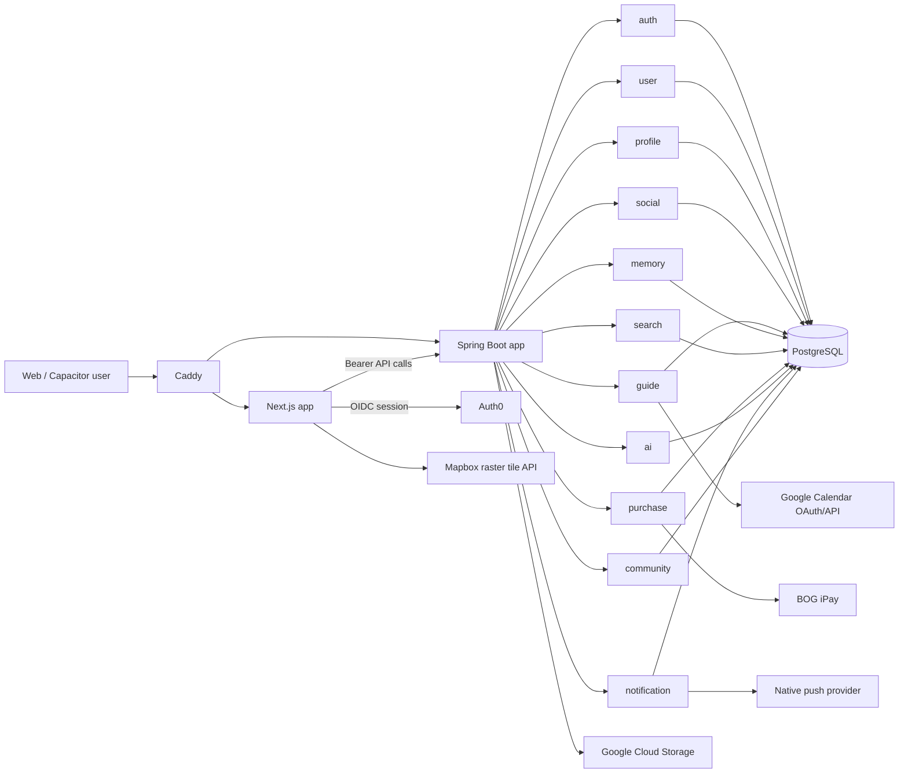

# Brooks Architecture and Product Quality Audit

Audit date: 2026-09-05
Linear issue: BOR-105
Scope: product architecture, UX/UI structure, frontend and backend performance, security/privacy, reliability, accessibility, mobile behavior, delivery configuration, tests, and persistent engineering rules.

This report is a durable decision record. It records what was inspected, the alternatives considered, changes applied, verification results, and risks deliberately left for separate work. It does not claim that a single targeted change set can replace device labs, production observability, penetration testing, or longitudinal user research.

## 1. Executive Summary

Brooks is already a substantial creator-led travel product rather than a prototype. It combines a guide marketplace, trip execution, map discovery, memories, social discovery, reviews, payments, notifications, and a Capacitor mobile shell. The current modular-monolith architecture is appropriate for the team and domain maturity: module ownership is visible without imposing distributed-system operational cost.

The highest-confidence BOR-105 Golden Path was targeted hardening instead of a redesign or a microservice rewrite. The applied changes address six concrete risks:

1. Public creator responses previously reused a private profile DTO and could expose email, exact profile coordinates, account role, onboarding state, and primary intent. Public and private contracts are now separate at `backend/profile/src/main/java/com/brooks/profile/dto/PublicProfileResponse.java:12` and `backend/profile/src/main/java/com/brooks/profile/service/ProfileService.java:75`.
2. Media uploads trusted the declared MIME type. Images and audio now undergo allow-list, size, and file-signature checks before local or GCS storage at `backend/app/src/main/java/com/brooks/app/media/MediaStorageService.java:131`.
3. Shared API calls had no finite timeout and map requests could complete out of order. The client now has a 15-second default timeout and caller cancellation at `web/src/lib/api.ts:16`, while map viewport requests abort obsolete work at `web/src/components/maps/MapsExperience.tsx:1767` and `web/src/components/maps/MapsExperience.tsx:1818`.
4. Native push/location permissions were requested too early. Push is now initiated from the notification surface and location from the map interaction, following contextual-permission principles at `web/src/components/PermissionsBootstrap.tsx:13`, `web/src/components/notifications/NotificationBell.tsx:194`, and `web/src/components/maps/MapsExperience.tsx:2010`.
5. Public creator pages rendered exact profile coordinates. The redundant exact-coordinate map was removed; the public region remains available through the public projection at `web/src/app/(public)/creators/[username]/page.tsx:25`.
6. `mapbox-gl` remained installed although runtime maps use Leaflet raster tiles. It was removed from `web/package.json`, reducing dependency and mobile-WebView risk.

No payment, guide-access, memory-visibility, navigation, or major visual behavior was changed. Backend tests, frontend lint, and the production Next.js build passed in validation iteration one. `npm audit --omit=dev` still reports 15 advisories (4 moderate, 10 high, 1 critical); these require controlled dependency upgrades rather than an unreviewed `npm audit fix`.

## 2. Application Purpose

Brooks connects creator knowledge and personal memories to physical places. Its core value loop is:

```text
discover place/creator/guide
        -> save or purchase an immutable guide version
        -> materialize and schedule a trip
        -> navigate places and contribute reviews/memories
        -> share, follow, and rediscover location-linked content
```

Primary user journeys identified in code and documentation:

- Discover creators, guides, places, and memories through the landing page, feed, search, creator profiles, and map.
- Save a guide before purchase, buy or receive it, and retain access to the purchased version.
- Turn a guide into a trip, schedule stops, mark progress, and connect Google Calendar or export ICS.
- Create, reveal, reply to, share, and delete text/image/audio memories under visibility and proximity rules.
- Create, edit, publish, soft-delete, and sell guides.
- Rate eligible guides, creators, and places; vote on review helpfulness.
- Receive in-app and native notifications and deep-link to the relevant context.

Product invariants are now recorded in `CLAUDE.md:1`. The issue description's assumptions were reconciled with the implementation: guide video/audio remains planned, while image/audio memory support, paid guides, reviews, map layers, and native bridges are already implemented.

## 3. Technology Stack

| Layer | Current technology | Audit conclusion |
| --- | --- | --- |
| Web | Next.js 14.2.25 App Router, React 18.3, TypeScript 5.5, Tailwind 3.4 | Suitable; route-level code splitting exists, but frontend test coverage is weak. |
| Mobile | Capacitor 6 Android/iOS shell | Appropriate for shared product velocity; native permission and WebView resource discipline are essential. |
| Map | Leaflet 1.9.4, markercluster, Mapbox raster tiles | Correct for current Android WebView constraints; avoid duplicate WebGL stack. |
| Backend | Java 21, Spring Boot 3.3.5, Gradle Kotlin DSL | Suitable for modular monolith and transactional domain workflows. |
| Persistence | PostgreSQL, Spring Data JPA/Hibernate, Flyway | Appropriate; strict migration discipline must continue. |
| Auth | Auth0 OIDC/JWT, Spring Resource Server | Sound foundation; authorization remains a service-boundary responsibility. |
| Payments | Bank of Georgia iPay hosted redirect and verified callback | Correct separation between financial purchase and guide-version access. |
| Storage | Local development storage or Google Cloud Storage | Functional; private/signed delivery remains future work. |
| Delivery | Docker, Caddy, GitHub Actions, GCP | Adequate; health checks and branch-trigger behavior need continued operational tests. |
| Localization | i18next with English and Georgian dictionaries | Appropriate; new permission copy was added to both locales. |

Backend modules are explicitly declared and existence-validated in `backend/settings.gradle.kts:1`. The frontend dependencies are defined in `web/package.json:1`.

## 4. Full Architecture Map



Architectural boundaries:

- HTTP flow generally follows `api -> service -> repository -> domain` with DTOs at boundaries.
- `app` composes modules and owns application bootstrap, shared media storage, cache configuration, and Flyway migrations.
- A single database allows transactions across modules; this is useful for payment/access consistency but increases the need for module ownership conventions.
- `PurchaseCompletedEvent` bridges the financial purchase aggregate to guide-version access/trip materialization.
- The browser/mobile client shares the same Next.js code and delegates device capabilities to narrowly scoped Capacitor bridges.
- Caddy is the external gateway and owns production security headers, compression, and routing.

## 5. Dependency Analysis

Dependency observations:

- The backend module graph is explicit and centrally versioned in `backend/settings.gradle.kts:1` and `backend/build.gradle.kts:1`.
- The frontend had both Leaflet and unused `mapbox-gl`. Removing `mapbox-gl` eliminates a duplicate rendering stack and its transitive packages without changing map behavior.
- `@capacitor/cli` is currently a production dependency in `web/package.json`. Because it is build tooling, moving it to `devDependencies` or isolating native builds should be assessed during the dependency-upgrade work.
- Auth0, Next.js/PostCSS, Sharp, Capacitor CLI, and their transitive chains account for the remaining production audit advisories. Automated major-version fixes were intentionally not applied because authentication, image processing, and native tooling need compatibility tests.
- Shared frontend API behavior is centralized in `web/src/lib/api.ts:70`, which is a high-leverage point for timeout, cancellation, authentication, and error semantics.

Three dependency strategies were considered:

| Approach | Strength | Stress result |
| --- | --- | --- |
| Freeze versions and suppress advisories | Lowest short-term regression risk | Rejected: known risk accumulates and security posture degrades. |
| Run `npm audit fix --force` | Fast advisory count reduction | Rejected: uncontrolled major upgrades can break Auth0, Next rendering, native builds, or Sharp. |
| Remove unused packages now, then upgrade critical chains in tested slices | Balances risk and progress | Golden Path: `mapbox-gl` removed now; remaining chains become explicit follow-up work. |

## 6. Module Interaction Analysis

The modular monolith is coherent but several interactions deserve protection:

- Profile public/private projection: the controller now returns `PublicProfileResponse` at `backend/profile/src/main/java/com/brooks/profile/api/ProfileController.java:37`. This prevents domain growth from silently widening a public response.
- Guide purchase/access: `purchases` is the financial aggregate, while `guide_purchases` records guide-version access. Combining them would break free, gift, creator-copy, and historical access cases.
- Memory visibility/reveal: visibility, direct grants, follower access, reveal state, and coordinate precision are authorization rules. They must stay enforced server-side even if the map hides items client-side.
- Map discovery: backend caps and viewport queries protect the client; frontend cancellation now protects state ordering during rapid pan/zoom.
- Notification registration: the bootstrap owns listeners and token upsert, while the notification UI owns consent initiation. This separates device lifecycle from permission UX.
- Media upload: both local and GCS paths now pass through the same validation entry point before storage at `backend/app/src/main/java/com/brooks/app/media/MediaStorageService.java:60`.

Observed architectural pressure points:

- `web/src/components/maps/MapsExperience.tsx` remains a large component combining map lifecycle, filters, viewport networking, memories, location, marker UI, and mobile panels.
- Shared database access can tempt cross-module repository coupling. Continue exposing module services/events instead.
- Frontend route components often orchestrate fetching directly, making cancellation/loading/error behavior inconsistent outside the shared API layer.

## 7. Benchmark Architecture Comparison

The audit compared Brooks with ten materially different product patterns. These are problem-solving references, not visual templates.

| Benchmark | Pattern and problem solved | Transferable to Brooks | Do not copy |
| --- | --- | --- | --- |
| Google Maps | Search-first map, place detail, saved lists, universal deep links | Persistent search, map/list context, provider URLs | Generic place utility must not erase creator provenance. |
| Apple Maps | Curated guides, visited places, offline maps | Guide curation, trip-time resilience, privacy framing | Apple-only assumptions conflict with cross-platform Brooks. |
| Airbnb | Map-bound discovery and wishlists | Viewport-driven results and save-before-purchase | Accommodation funnel is narrower than Brooks' rich guide/memory model. |
| AllTrails | Search/filter/map plus custom lists | Scannable route/guide summaries and explicit filters | Trail-specific safety/difficulty taxonomy is not universal travel data. |
| Komoot | Collections and route inspiration | Ordered collections and mobile execution | Sports-routing emphasis would distort creator guides. |
| Strava | Saved/generated community routes | Clear saved state and location-based route generation | Competitive metrics and public activity defaults are wrong for memories. |
| Polarsteps | Trip timeline and media memory narrative | Temporal story of a completed trip | Automatic travel tracking creates unnecessary location privacy risk. |
| Tripadvisor | Reviews, confidence, offline city content | Trust signals, review provenance, offline-read direction | High-density commercial inventory would overwhelm Brooks' creator focus. |
| Snapchat Snap Map | Opt-in location sharing and audience controls | Location off by default, explicit audience/visibility controls | Live-friend tracking is not Brooks' current memory model. |
| Instagram location/social map patterns | Creator/media-led place discovery | Creator identity and media context around places | Engagement-first ranking can obscure utility and trust. |

Primary-source evidence used:

- [Google Maps developer documentation](https://developers.google.com/maps/documentation) and [Maps URLs](https://developers.google.com/maps/documentation/urls/get-started).
- [Apple Maps Guides](https://support.apple.com/guide/iphone/explore-places-with-guides-iph4c213d62d/26/ios/26), [Places](https://support.apple.com/en-gb/guide/iphone/iph6838243e8/ios), and [offline maps](https://support.apple.com/en-us/105084).
- [Airbnb wishlists](https://www.airbnb.com/help/article/1236), [map search](https://www.airbnb.com/help/article/252), and [location privacy](https://www.airbnb.com/resources/hosting-homes/a/how-to-add-your-location-358).
- [AllTrails custom lists](https://support.alltrails.com/hc/en-us/articles/360018930952-How-to-create-a-new-custom-list) and [search/filter/map onboarding](https://support.alltrails.com/hc/en-us/articles/37200401098516-Getting-started-on-AllTrails).
- [Komoot Collections](https://support.komoot.com/hc/en-us/articles/360032778832-Premium-Collections) and [route discovery](https://support.komoot.com/hc/en-us/articles/10207999797530-Find-routes-and-inspiration-on-komoot).
- [Strava saved routes](https://support.strava.com/en-us/articles/15401678-saved-routes-on-web) and [community routes](https://support.strava.com/en-us/articles/15401756-generated-community-routes).
- [Snap Map location sharing](https://help.snapchat.com/hc/en-us/articles/7012309470740-How-do-I-share-my-location-on-Snap-Map) and [privacy reminder](https://help.snapchat.com/hc/en-gb/articles/24547077410580-Snap-Map-Privacy-Safety-Reminder).
- [Tripadvisor offline travel content](https://ir.tripadvisor.com/static-files/4f39602d-d272-4589-995c-36333185fb90) and [review research](https://www.tripadvisor.com/powerofreviews.pdf).

Cross-benchmark conclusion: Brooks should retain its creator-plus-memory distinction while borrowing explicit saving, viewport-bound discovery, contextual permissions, clear provenance, and offline-aware trip execution.

## 8. Deviation Analysis

Brooks was compared with three architecture models:

| Model | Fit | Main deviation/risk |
| --- | --- | --- |
| Layered modular monolith | Best current fit | Some frontend components are not as modular as backend domains. |
| Evented modular monolith | Target evolution | Events exist for important flows, but not all cross-module interactions are consistently evented. |
| Microservices | Premature for current scope | Would add distributed transactions, observability, deployment, and schema-ownership cost without proven load/team need. |

Golden Path: remain a modular monolith, strengthen public contracts and module ownership, and introduce events/outbox semantics only where asynchronous reliability is valuable. Extract a service only when independent scaling, ownership, data isolation, or failure containment is measured and persistent.

Primary deviations from a mature target state:

- Public/private projection had not been consistently separated for creator profiles. Fixed.
- Media type verification was metadata-only. Fixed at the first validation layer, with deeper decoding/scanning still recommended.
- Map network requests lacked complete timeout/order control. Fixed for high-churn viewport calls.
- Permission prompts were lifecycle-driven rather than intent-driven. Fixed.
- Mobile rendering stack dependencies did not match actual runtime architecture. Fixed by removing `mapbox-gl`.
- Automated browser, native-device, accessibility, and performance regression coverage remains insufficient.

## 9. Technical Debt Analysis

| Debt | Severity | Effort | Evidence / effect |
| --- | --- | --- | --- |
| Decompose `MapsExperience` into map adapter, viewport-query hooks, layer state, and mobile panels | High | Large | Mixed responsibilities around `web/src/components/maps/MapsExperience.tsx:1767`. |
| Add frontend component and E2E tests | High | Large | Current package scripts expose lint/build but no web test command in `web/package.json:5`. |
| Upgrade vulnerable dependency chains deliberately | High | Medium/Large | `npm audit --omit=dev`: 15 advisories. |
| Replace inline-script CSP allowance with nonce-based policy | High | Medium | Caddy hardening still depends on Next runtime compatibility. |
| Add global and sensitive-route throttling | High | Medium | Auth, upload, search, review, and payment-abuse controls need uniform policy. |
| Add private/signed media delivery for private memories | High | Large | Current GCS URLs are public at `backend/app/src/main/java/com/brooks/app/media/MediaStorageService.java:198`. |
| Introduce production RUM/APM and trace correlation | Medium | Medium | Build size is available, but real LCP/INP/CLS and API p95 are not captured here. |
| Complete account deletion and OAuth revocation lifecycle | Medium | Medium | Recorded in `CLAUDE.md` residual work. |
| Normalize old mojibake comments | Low | Small | Some historical source comments contain malformed punctuation; runtime unaffected. |

Debt should be sequenced by risk reduction, not by aesthetic refactoring.

## 10. Bugs Found

Confirmed and remediated:

1. **Critical privacy contract bug:** public creator endpoint reused `ProfileResponse`, allowing private account/location fields to serialize. Fixed with a dedicated DTO and regression test at `backend/profile/src/test/java/com/brooks/profile/service/ProfileServiceTest.java:63`.
2. **High upload-validation bug:** a file could declare an allowed MIME type while containing unrelated bytes. Fixed with signature checks and mismatch tests at `backend/app/src/test/java/com/brooks/app/media/MediaStorageServiceTest.java`.
3. **High stale-map-state bug:** slower obsolete viewport responses could overwrite newer map results. Fixed with abort controllers and sequence validation at `web/src/components/maps/MapsExperience.tsx:1792`.
4. **Medium infinite-wait failure mode:** shared JSON requests had no deadline. Fixed with the timeout controller at `web/src/lib/api.ts:88`.
5. **Medium permission UX bug:** native prompts could occur without direct feature intent. Fixed by event-driven push opt-in and map-context location checks.
6. **Medium public-location leak in UI:** creator profile rendered a precise-coordinate map. Removed while retaining region display.
7. **Low duplicate runtime dependency:** WebGL map library remained installed although maps use Leaflet raster tiles. Removed.

Observed but not changed in this targeted pass:

- Production build logs show Auth0 dynamic-route warnings for `/api/auth/logout-app` and `/api/auth/init-app`; builds succeed, but route behavior should receive an authenticated E2E test.
- Lint reports existing `` optimization warnings and selected hook-dependency warnings. These are not compile errors but indicate performance/maintenance opportunities.

## 11. Security Issues Found

Security review was aligned to the [OWASP API Security Top 10 2023](https://owasp.org/API-Security/editions/2023/en/0x11-t10/).

| Finding | OWASP relationship | Status |
| --- | --- | --- |
| Public endpoint overexposed private profile fields | API3 Broken Object Property Level Authorization | Fixed with a narrow public projection. |
| Upload MIME metadata trusted without content verification | API8 Security Misconfiguration / unsafe file handling | Fixed at signature level; decoder/scanner defense remains. |
| Exact profile coordinates displayed publicly | API3 / privacy exposure | Fixed by removing precise map rendering. |
| No universal API timeout/cancellation | API4 Unrestricted Resource Consumption / reliability | Improved on shared client and map queries. |
| Missing global throttling strategy | API4 Unrestricted Resource Consumption | Open, high severity. |
| Public media URLs for potentially private content | API1/API3 depending object visibility | Open, high severity if private media uses these URLs. |
| CSP includes `unsafe-inline` | API8 / browser hardening | Open, high severity defense-in-depth item. |
| Dependency advisories | API8 / supply chain | Open; controlled upgrades required. |

Upload remediation alternatives stress-tested:

1. Trust extension/MIME metadata: fastest, rejected as bypassable.
2. Magic-byte signatures: low-cost, blocks common mismatch attacks, selected now.
3. Full decode/transcode plus malware scanning and quarantined object promotion: strongest, recommended next for production private media, but operationally larger.

Public-profile remediation alternatives stress-tested:

1. Jackson ignore annotations on the private DTO: fragile as fields evolve.
2. Map/filter fields in the controller: duplicates policy and is easy to miss.
3. Dedicated immutable public projection assembled by the profile service: selected Golden Path because the allowed surface is explicit and testable.

## 12. Refactorings Applied

- Introduced `PublicProfileResponse` and a dedicated `toPublicResponse` mapper.
- Added `PublicProfile` to frontend types and changed creator profile fetch state to use it.
- Removed the public creator exact-coordinate Leaflet instance and associated lifecycle code.
- Centralized request timeout and caller abort handling in the shared API client.
- Added map request cancellation and last-request-wins sequencing.
- Split native push-consent initiation from listener/token lifecycle through `pushPermission.ts`.
- Moved native location prompt behavior into the map-use context.
- Centralized file-signature verification before both storage implementations.
- Removed unused `mapbox-gl` package and lockfile entries.
- Replaced stale repository agent guidance with current architecture, product invariants, security, mobile, and delivery rules.
- Adjusted Caddy Permissions-Policy so same-origin camera/microphone/geolocation can support approved user-initiated features.

## 13. Files Changed

| File | Change |
| --- | --- |
| `CLAUDE.md` | Current architecture, domain rules, mobile/security policy, delivery guidance, residual work. |
| `backend/profile/.../PublicProfileResponse.java` | New public creator contract. |
| `backend/profile/.../ProfileController.java` | Public endpoint returns public DTO. |
| `backend/profile/.../ProfileService.java` | Separate public mapping. |
| `backend/profile/.../ProfileServiceTest.java` | Prevents reintroduction of private fields. |
| `backend/app/.../MediaStorageService.java` | Magic-byte validation. |
| `backend/app/.../MediaStorageServiceTest.java` | Valid and mismatched media tests. |
| `web/src/lib/api.ts` | Timeout, cancellation, abort classification, safe GET coalescing. |
| `web/src/components/maps/MapsExperience.tsx` | Abort/staleness control and contextual native location request. |
| `web/src/components/PermissionsBootstrap.tsx` | No cold-start prompts; listener cleanup; explicit push request handling. |
| `web/src/lib/pushPermission.ts` | Native push permission event/status bridge. |
| `web/src/components/notifications/NotificationBell.tsx` | Explicit opt-in/settings UI. |
| `web/src/app/(public)/creators/[username]/page.tsx` | Public type and precise-map removal. |
| `web/src/types/index.ts` | Public profile contract. |
| `web/src/i18n/dictionaries/en.json` | Permission copy. |
| `web/src/i18n/dictionaries/ka.json` | Georgian permission copy. |
| `web/package.json`, `web/package-lock.json` | Removed unused `mapbox-gl`. |
| `infra/Caddyfile.prod` | Context-compatible same-origin permissions policy. |
| `web/src/app/(app)/maps/page.tsx` | Correct map implementation documentation. |
| `web/src/app/privacy/page.tsx` | Typography punctuation normalization. |

## 14. Why Each Change Was Made

- **Public DTO:** privacy must be allow-list based. A public response should not inherit private fields merely because both represent a profile.
- **Signature validation:** browser-provided content type is attacker-controlled metadata; content evidence must agree before storage.
- **API timeout:** a recoverable timeout is preferable to a permanent spinner, especially on mobile networks.
- **Abort and sequence guard:** abort saves work; sequence guards correctness even when cancellation races with completion.
- **Contextual permissions:** users make better consent decisions when the prompt follows a clear action and explained value. This follows [Apple's privacy guidance](https://developer.apple.com/design/human-interface-guidelines/privacy).
- **Precise creator map removal:** a public profile can communicate region without implying or leaking a person's exact current/home position.
- **Leaflet-only dependency graph:** one renderer lowers bundle/install complexity and avoids the known Android WebView texture pressure documented in source comments.
- **Caddy policy:** browser policy must permit the same-origin capabilities the product intentionally exposes while still denying cross-origin use.
- **Persistent rules:** future work needs an accurate source of architecture and privacy invariants to avoid repeating resolved mistakes.

## 15. Test / Build Results

Validation iteration one:

| Command | Result |
| --- | --- |
| `backend\gradlew.bat test --no-daemon` | Passed; Gradle `BUILD SUCCESSFUL`, 47 actionable tasks. |
| `web\npm run lint` | Passed with pre-existing warnings only. |
| `web\npm run build` | Passed; compiled, type-checked, and generated 56 pages. |
| `git diff --check` | Passed; no whitespace errors. |
| `npm audit --omit=dev` | Completed with 15 unresolved advisories: 4 moderate, 10 high, 1 critical. |

Validation iteration two, after the report and final source review:

| Command | Result |
| --- | --- |
| `backend\gradlew.bat test --no-daemon` | Passed; Gradle `BUILD SUCCESSFUL`, all 47 tasks consistent/up to date. |
| `web\npm run lint` | Passed with the same documented warnings and no errors. |
| `web\npm run build` | Passed again; compiled, type-checked, and generated all 56 pages. |
| `git diff --check` | Passed after final documentation update. |

Observed production build route sizes included approximately 110 kB first load for landing, 124 kB for creator profile, 140 kB for maps, and 128 kB for trip detail. These are build artifacts, not real-user Core Web Vitals.

No production-like database load test, mobile device matrix, browser E2E suite, or Lighthouse/RUM capture was available in this pass. [Core Web Vitals](https://web.dev/articles/vitals) should be measured from production-like data before claiming runtime improvement.

## 16. Remaining Risks

1. **High:** 15 npm advisories remain. Upgrade Auth0/Next/Sharp/Capacitor chains in separate compatibility-tested increments.
2. **High:** private media confidentiality is not guaranteed by a public GCS URL architecture.
3. **High:** API-wide and sensitive-flow rate limiting is not centrally enforced.
4. **High:** frontend E2E/component coverage is too small for the product surface.
5. **High:** `MapsExperience` complexity creates regression risk and makes mobile performance tuning difficult.
6. **Medium:** CSP uses `unsafe-inline`; migrate to nonces/hashes with a Next-compatible deployment design.
7. **Medium:** account deletion confirmation/hard-delete and Google OAuth revocation are incomplete.
8. **Medium:** keyword moderation is insufficient for multilingual obfuscation, images, audio, appeals, and coordinated abuse.
9. **Medium:** signature checks identify file families but do not prove safe decodability or remove dangerous metadata.
10. **Medium:** native permission behavior needs Android/iOS version-matrix testing, including denied and permanently denied states.

## 17. Recommended Future Improvements

Recommendations are ordered by severity and then expected risk reduction.

| Priority | Recommendation | Effort |
| --- | --- | --- |
| P0 | Upgrade/remediate vulnerable production dependency chains with lockfile review, Auth0 regression tests, image tests, and native builds | Medium/Large |
| P0 | Design authenticated/signed media delivery for private/direct/follower memories | Large |
| P0 | Add gateway and application rate limits for auth, upload, search, reviews, memories, payments, and AI endpoints | Medium |
| P1 | Add Playwright critical-journey E2E tests and backend authorization matrix tests | Large |
| P1 | Decompose map behavior behind tests without changing UX | Large |
| P1 | Add image/audio decode, metadata stripping, quarantine, scanning, and asynchronous promotion | Large |
| P1 | Add production RUM for LCP/INP/CLS, API p50/p95/p99, errors, and trace IDs | Medium |
| P1 | Complete deletion lifecycle and calendar OAuth revocation | Medium |
| P2 | Convert high-impact `` usage to `next/image` where authenticated/external URL policy permits | Medium |
| P2 | Introduce nonce-based CSP and remove avoidable inline allowances | Medium |
| P2 | Build multilingual classifier moderation, moderation queues, appeals, and audit trails | Large |

[Next.js lazy loading](https://nextjs.org/docs/14/app/building-your-application/optimizing/lazy-loading) and [image optimization](https://nextjs.org/docs/14/app/building-your-application/optimizing/images) are the primary references for future bundle/media work. Accessibility targets should continue to follow [WCAG 2.2 target size guidance](https://www.w3.org/WAI/WCAG22/Understanding/target-size-minimum.html).

## 18. Adaptability Analysis

The architecture adapts well to near-term product development because:

- New domains can be added as Gradle modules and composed in one deployable.
- Public API projection types can evolve independently from account DTOs.
- The shared Next.js/Capacitor UI allows a single feature implementation while native bridges remain isolated.
- Flyway provides deterministic schema evolution.
- Provider integrations are already represented as bounded concerns rather than scattered UI logic.

Adaptability constraints:

- One large map component slows independent evolution of memories, creator discovery, and guide layers.
- Shared database ownership needs stronger automated architectural tests as the team grows.
- Provider-specific calendar/payment details must stay behind interfaces to add Outlook, Apple/calendar standards, or additional payment providers safely.
- Advanced media types should reuse one policy/scanning pipeline rather than extending allow-lists in multiple modules.

## 19. Scalability Analysis

Current architecture can scale vertically and horizontally as a stateless application behind Caddy/load balancing, provided sessions remain external/token-based and local media is not used in production.

Likely first bottlenecks:

- Spatial/viewport queries and marker payloads during dense-city map use.
- Feed/search ranking and repeated creator/guide projections.
- Media transformation and delivery bandwidth.
- Notification fan-out and proximity computation.
- Payment/calendar provider latency and retry behavior.

Scaling Golden Path:

1. Measure real endpoint latency, query plans, cache hit rate, payload size, and map marker count.
2. Add/verify spatial and ranking indexes, bounded pagination, projections, and cache semantics.
3. Move media transformation, notification fan-out, email, and provider retries to durable asynchronous jobs with an outbox.
4. Scale the monolith horizontally while preserving idempotency.
5. Extract only a demonstrated independently scaling boundary, likely media processing or notification delivery, rather than splitting transactional guide/purchase access prematurely.

## 20. Long-Term Architecture Recommendations

The recommended target is an **evented modular monolith with selective service extraction**, not a wholesale microservice migration.

Three long-term options were stress-tested:

| Option | User value | Reliability/security | Team/operational cost | Decision |
| --- | --- | --- | --- | --- |
| Keep the current monolith unchanged | Fast initially | Coupling and large-component risks grow | Low now, rising later | Rejected as passive debt accumulation. |
| Split all modules into microservices | No immediate UX gain | Adds network failure and distributed consistency risk | Very high | Rejected until scale/ownership evidence exists. |
| Strengthen module contracts, add outbox/events, extract only measured hotspots | Preserves delivery speed | Improves reliability boundaries incrementally | Controlled | Golden Path. |

Long-term sequence:

1. Enforce module boundaries with architecture tests and explicit public module APIs.
2. Add durable outbox processing for payment-completed access, notifications, moderation, and external provider work.
3. Establish observability and SLOs before any service extraction.
4. Build a secure media pipeline with private object access and variant generation.
5. Establish design tokens and tested responsive primitives while preserving the current Muted Warhol identity.
6. Add offline/read-through trip support and conflict-aware local progress synchronization.
7. Add privacy tooling for coordinate precision, audience inspection, export, revocation, and deletion auditing.
8. Extract a module only when its scaling profile, release cadence, failure domain, or compliance boundary is materially independent.

The central architectural principle is to preserve Brooks' distinctive location-linked creator and memory model while reducing accidental disclosure, stale state, unbounded work, and platform friction through explicit contracts and measurable controls.
