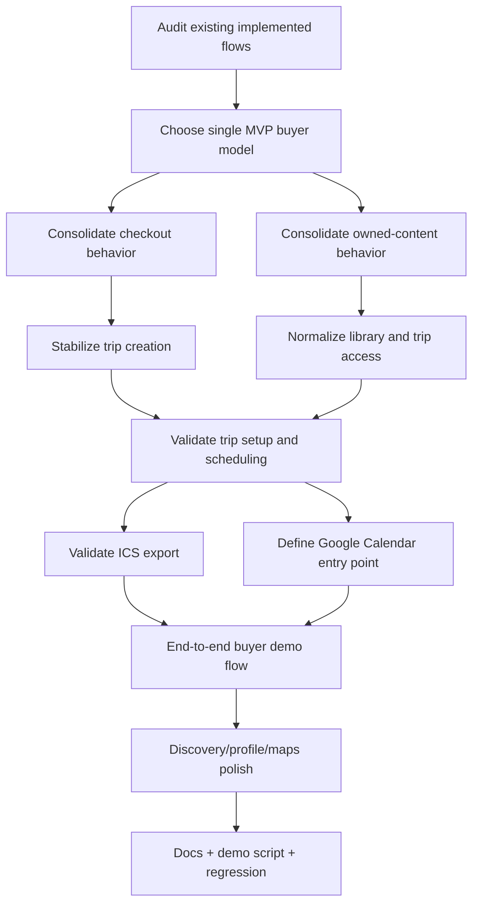

# Brooks 4-Day MVP Plan

Last updated: 2026-04-16  
Target: Internal demo-ready MVP  
Team assumption: 1 full-stack engineer  
Platform scope: Web + backend only  
Payment scope: Mock checkout  
Calendar scope: Google entry point + ICS fallback

---

## 1. Current Project Phases

This section separates what is already implemented from what still needs work.

### Phase 1: Foundation
Status: Implemented

- Spring Boot modular monolith exists
- Next.js web app exists
- PostgreSQL + Flyway migrations exist
- Docker/Caddy local infrastructure exists
- Auth0 auth flow exists
- Backend and web builds exist

### Phase 2: User, Profile, and Social Base
Status: Mostly implemented

- user creation/auth callback exists
- profile backend exists
- creator profile page exists
- follow/unfollow flow exists
- stories backend exists
- feed backend and feed page exist

### Phase 3: Guide Creation and Publishing
Status: Implemented

- guide CRUD exists
- day/block/place guide structure exists
- guide publishing exists
- guide version snapshots exist
- guide preview exists
- creator guide listing exists

### Phase 4: Discovery
Status: Partially implemented

- search API exists
- search pages exist
- maps page exists
- viewport-based influencer discovery exists
- map filters exist
- discovery still needs polish and consistency

### Phase 5: Buyer Journey
Status: Partially implemented

- saved guides exist
- purchase logic exists
- trip creation exists
- trip detail/setup exists
- ICS calendar export exists
- buyer flow is split across more than one model and needs consolidation

### Phase 6: Monetization / Admin / AI Extensions
Status: Early / partial

- admin commission-related pages and migrations exist
- AI module exists
- AI key management exists
- advanced marketplace logic is not MVP-ready

### Phase 7: Mobile
Status: Not implemented

- mobile is not part of this 4-day MVP plan

---

## 2. MVP Goal for the Next 4 Days

The 4-day goal is not to build the whole product vision. It is to make the current app coherent and demoable.

### Required MVP user flow

1. User discovers a guide
2. User opens guide preview
3. User saves guide
4. User buys guide
5. Purchased guide becomes a trip
6. User opens trip
7. User sets travel dates
8. User exports or adds trip to calendar
9. User clearly sees the map + calendar planning value

### Explicitly out of scope

- guide fork system
- guide merge system
- AI overlap scoring
- revenue split logic
- badge system
- restaurant/category monetization logic
- audio guide product
- mobile implementation
- production launch hardening

---

## 3. Priority Model

### P0
Must be completed for the MVP to work

- one clear purchase flow
- one clear purchased-content flow
- trip creation and trip opening work
- trip setup works
- calendar actions work
- save guide works
- internal demo flow works end-to-end

### P1
Should be completed if time allows

- UI consistency between guides, purchases, and trips
- clearer error states
- discovery/profile/maps polish
- cleanup of outdated labels and placeholder wording

### P2
Nice to have

- admin cleanup
- AI surface cleanup
- future roadmap prep

---

## 4. Kanban Board

### Backlog

- [ ] Audit all purchase-related frontend calls
- [ ] Audit all purchased-guide backend APIs
- [ ] Choose one canonical buyer flow
- [ ] Normalize saved / purchased / trips information architecture
- [ ] Validate guide save flow
- [ ] Validate mock checkout flow
- [ ] Validate trip seeding flow
- [ ] Validate trip setup flow
- [ ] Validate ICS export flow
- [ ] Add or standardize Google Calendar entry path
- [ ] Polish guide preview flow
- [ ] Polish trip detail flow
- [ ] Polish creator/discovery surfaces
- [ ] Update docs to match actual implementation
- [ ] Prepare demo data and demo script
- [ ] Run full regression checks

### Ready

- [ ] Checkout path consolidation
- [ ] Buyer library consolidation
- [ ] Calendar UX consolidation
- [ ] Copy and route consistency cleanup

### In Progress

Rule: maximum 2 active tasks at once for 1 engineer

### Review / Verify

- [ ] Backend compile check
- [ ] Web build check
- [ ] Manual walkthrough check
- [ ] Internal demo rehearsal

### Done

- [ ] User can complete the full buyer journey without confusion
- [ ] Demo script works without developer intervention

---

## 5. Day-by-Day Plan

## Day 1 — Consolidate the Buyer Model
Date: Day 1  
Priority: P0

### Main objective
Remove the biggest architecture confusion: more than one purchase / ownership model is visible in the product flow.

### To Do

- [ ] List all web pages that use purchase data
- [ ] List all web pages that use trip data
- [ ] List all endpoints used for buying a guide
- [ ] List all endpoints used for opening purchased content
- [ ] Choose the canonical MVP model: guide purchase creates trip
- [ ] Choose the canonical buyer-owned object: trip
- [ ] Define final user-facing terminology for:
  - [ ] Guides
  - [ ] Saved
  - [ ] Purchased
  - [ ] Trips
- [ ] Identify legacy flow pieces that should no longer drive the main UX

### Done criteria

- [ ] One canonical buyer flow is documented
- [ ] One canonical post-purchase object is documented
- [ ] There is no unresolved product ambiguity about purchase vs trip

---

## Day 2 — Stabilize the End-to-End Buyer Flow
Date: Day 2  
Priority: P0

### Main objective
Make the user journey reliable from preview to trip opening.

### To Do

- [ ] Confirm preview page is the single pre-purchase entry point
- [ ] Confirm save / unsave behavior is consistent
- [ ] Confirm buy action redirects to the correct destination
- [ ] Confirm purchased guide always resolves to a trip
- [ ] Confirm user can reopen trip later from library
- [ ] Confirm duplicate purchase behavior is handled
- [ ] Confirm creator cannot purchase own guide
- [ ] Confirm missing-email purchase edge case is handled
- [ ] Confirm broken snapshot / broken trip states return recoverable errors
- [ ] Confirm preview does not leak full itinerary before purchase

### Done criteria

- [ ] Fresh buyer can complete preview -> save -> buy -> trip
- [ ] Returning buyer can reopen purchased content reliably
- [ ] All major failure states have understandable messages

---

## Day 3 — Deliver the Planning Value
Date: Day 3  
Priority: P0

### Main objective
Make the product value obvious through trip setup and calendar flow.

### To Do

- [ ] Confirm trip dates can be set from trip detail
- [ ] Confirm scheduled trip items are generated correctly
- [ ] Confirm timezone behavior is usable
- [ ] Confirm ICS export works
- [ ] Add or standardize Google Calendar action
- [ ] Confirm fallback behavior:
  - [ ] Google Calendar entry path
  - [ ] ICS fallback for Apple / Outlook
- [ ] Confirm map context is easy to reach from the purchased trip flow
- [ ] Confirm trip page explains the planning value clearly

### Done criteria

- [ ] User can set dates and get a usable calendar result
- [ ] Internal demo clearly shows the planning benefit of the app

---

## Day 4 — Polish, Documentation, Demo Readiness
Date: Day 4  
Priority: P0 / P1

### Main objective
Turn the now-stable flow into a demoable product walkthrough.

### To Do

- [ ] Walk through `/search`
- [ ] Walk through `/maps`
- [ ] Walk through creator profile page
- [ ] Walk through guide preview page
- [ ] Walk through save flow
- [ ] Walk through buy flow
- [ ] Walk through trip page
- [ ] Walk through calendar actions
- [ ] Remove outdated placeholder wording where it is misleading
- [ ] Update docs to match real implementation state
- [ ] Prepare demo accounts / demo data
- [ ] Write exact internal demo script
- [ ] Run final backend compile
- [ ] Run final web build
- [ ] Run final manual regression

### Done criteria

- [ ] Internal team can repeat the demo path end-to-end
- [ ] Documentation reflects the repo truth
- [ ] Remaining gaps are explicitly listed

---

## 6. Tiny To-Do List by Priority

## P0 Tiny Tasks

- [ ] Confirm canonical checkout endpoint
- [ ] Confirm canonical post-purchase route
- [ ] Confirm canonical buyer library structure
- [ ] Confirm save status endpoint usage
- [ ] Confirm trip lookup by guide behavior
- [ ] Confirm post-purchase redirect target
- [ ] Confirm trip setup route behavior
- [ ] Confirm trip schedule generation behavior
- [ ] Confirm calendar export route behavior
- [ ] Confirm Google Calendar entry behavior
- [ ] Confirm self-purchase prevention
- [ ] Confirm duplicate purchase prevention
- [ ] Confirm buyer can reopen purchased content later
- [ ] Confirm internal demo path does not require manual DB edits

## P1 Tiny Tasks

- [ ] Align “purchases” vs “trips” terminology
- [ ] Align CTA wording on preview/trip pages
- [ ] Align empty-state wording
- [ ] Align profile/discovery wording with actual product state
- [ ] Align navigation between search, maps, creators, guides, trips
- [ ] Update planning and product docs

## P2 Tiny Tasks

- [ ] Inventory admin pages for later roadmap
- [ ] Inventory AI surfaces for later roadmap
- [ ] Note future fork/merge architecture impact

---

## 7. Network Diagram

### Critical path

1. Audit implemented flows
2. Choose one buyer model
3. Stabilize checkout to trip creation
4. Stabilize trip setup
5. Stabilize calendar actions
6. Validate the demo path

If time slips, cut polish first, not the critical path.

---

## 8. Definition of Done

The 4-day MVP is done when all of the following are true:

- [ ] User can discover a guide
- [ ] User can preview a guide
- [ ] User can save a guide
- [ ] User can buy a guide
- [ ] Purchased guide becomes a trip
- [ ] User can reopen the trip later
- [ ] User can set trip dates
- [ ] User can use calendar output
- [ ] The flow is understandable without developer explanation
- [ ] Docs and demo path match the real app

---

## 9. Future Phases After This MVP

### Future Phase A — Marketplace Stabilization

- ratings
- trust indicators
- stronger creator analytics

### Future Phase B — Forking and Remix

- fork guide
- reprioritize items
- add / remove locations
- sell forked guides

### Future Phase C — Merge and AI Similarity

- overlap detection
- merge recommendations
- AI similarity scoring
- revenue split logic

### Future Phase D — Commercial Category Expansion

- paid restaurant/commercial location support
- richer POI validation
- partner discounts

### Future Phase E — Audio and On-Trip Intelligence

- geofenced audio
- approval logic
- location-triggered playback

### Future Phase F — Mobile

- real mobile app
- parity with validated buyer flow

---

## 10. Final Guidance

Brooks should not be treated as a blank-slate project. The foundation and a large amount of product functionality already exist.

The correct 4-day strategy is:

- preserve what is already implemented
- do not open new advanced product fronts
- unify the buyer flow
- make the map + calendar value obvious
- make the internal demo stable
- defer fork/merge vision work until after MVP coherence

## Review Moderation Follow-up

- Replace the current keyword-only review blocklist with a stronger moderation pipeline.
- Add an admin moderation queue for flagged creator and guide reviews.
- Add audit logging for hidden or removed reviews and repeated vote abuse patterns.
